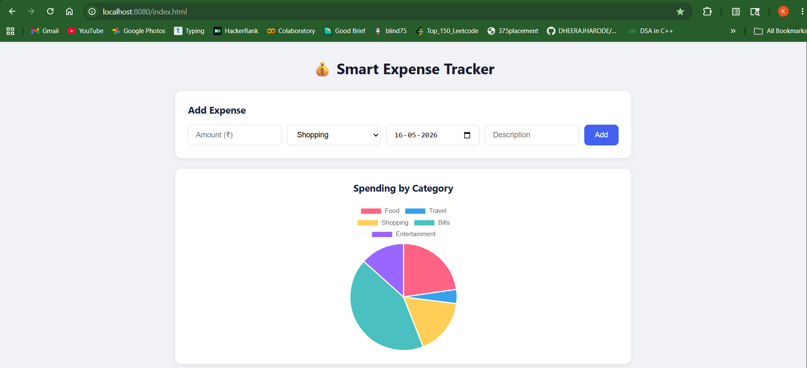
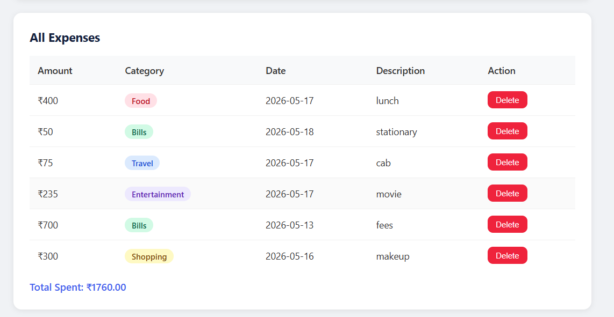
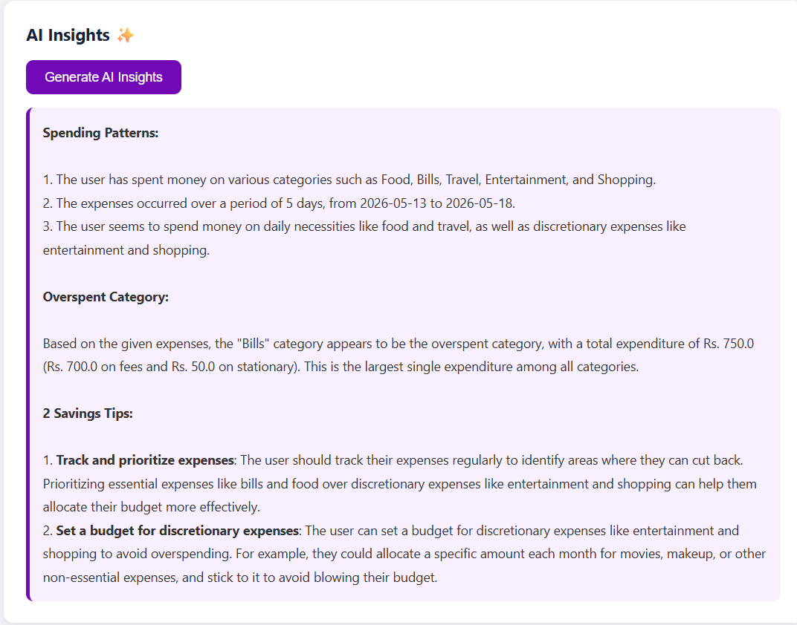

# Smart Expense Tracker with AI Insights

A full-stack web application built with Java Spring Boot that helps users 
track daily expenses and generates AI-powered financial insights.

## Tech Stack
- **Backend:** Java, Spring Boot, Spring Data JPA
- **Database:** H2 (in-memory)
- **Frontend:** HTML, CSS, JavaScript
- **AI:** Groq API (Llama 3.3)
- **Charts:** Chart.js

## Features
- Add, view, delete expenses by category
- Interactive pie chart by spending category
- AI-generated spending insights and savings tips
- REST API backend

## API Endpoints
| Method | Endpoint | Description |
|--------|----------|-------------|
| POST | /api/expenses | Add new expense |
| GET | /api/expenses | Get all expenses |
| DELETE | /api/expenses/{id} | Delete expense |
| GET | /api/insights | Get AI insights |

## Setup Instructions
1. Clone the repo
2. Copy `application.properties.example` to `application.properties`
3. Add your Groq API key
4. Run `.\mvnw.cmd spring-boot:run`
5. Open `http://localhost:8080/index.html`

## Screenshots

